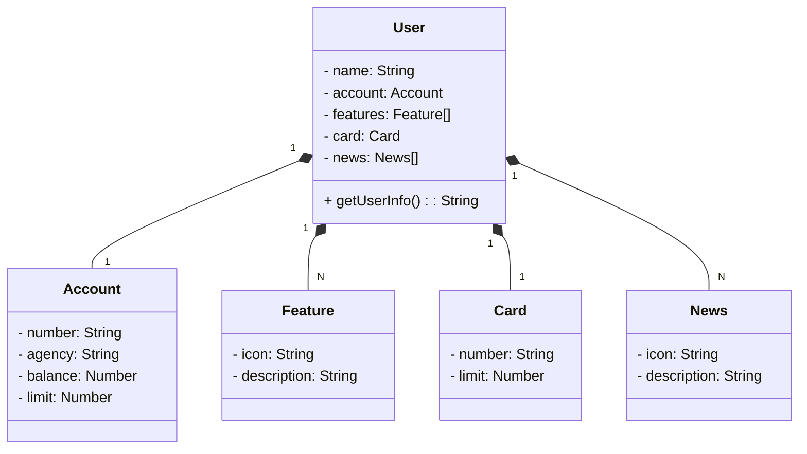

# Santander Dev Week 2023 pt 2
projeto java api rest usando spring boot 3, java 11 ou 17 e railway

## Diagrama de Classes

```mermaid
classDiagram
class User {
    - name: String
    - account: Account
    - features: Feature[]
    - card: Card
    - news: News[]

    + getUserInfo(): String
  }

  class Account {
    - number: String
    - agency: String
    - balance: Number
    - limit: Number
  }

  class Feature {
    - icon: String
    - description: String
  }

  class Card {
    - number: String
    - limit: Number
  }

  class News {
    - icon: String
    - description: String
  }

  User "1" *-- "1" Account 
  User "1" *-- "N" Feature
  User "1" *-- "1" Card 
  User "1" *-- "N" News 


```
